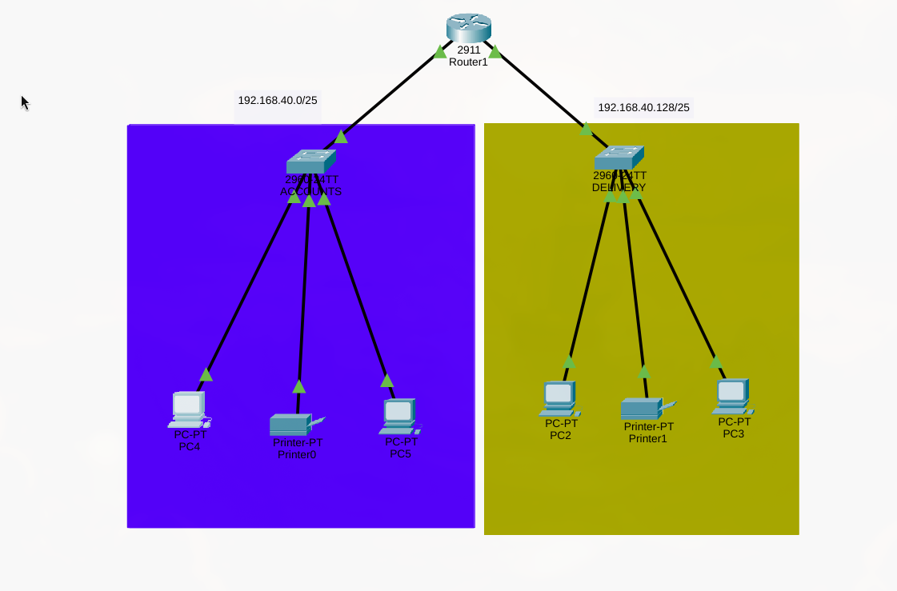
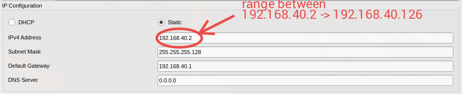
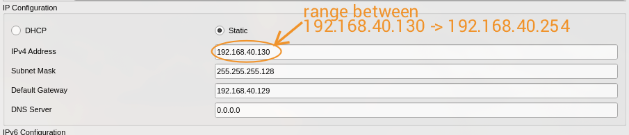
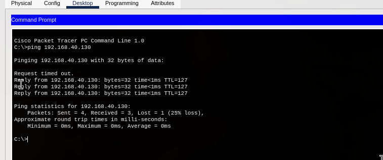

# Enterprise Network Design – Cisco Packet Tracer

##  Project Overview
This project demonstrates the design and configuration of a **small enterprise network** using **Cisco Packet Tracer**.  
The goal is to connect two departments — **ACCOUNTS** and **DELIVERY** — using proper subnetting, routing, and device configuration, and to verify end-to-end connectivity between them.



---

##  Objectives
- Design a functional enterprise network topology
- Apply IPv4 subnetting
- Configure router and host IP addressing
- Ensure inter-department communication using ICMP (ping)

---

##  Network Requirements
- Each department contains **at least 2 PCs**
- Appropriate number of **switches and routers**
- Use the network address: **192.168.40.0**
- Proper configuration of:
  - IP addresses
  - Subnet masks
  - Default gateways
- Devices connected using appropriate cables
- **PCs in the DELIVERY department must successfully ping PCs in the ACCOUNTS department**

---

##  Network Topology
The network consists of:
- 1 Router
- 2 Switches (one per department)
- 4 PCs (2 per department)

---

##  Subnetting Details

### Given
- Network Address: `192.168.40.0`
- Number of subnets required: `2`

### Calculation
Network address = 192.168.40.0
No. subnets =2
N = log2(2) = 1 borrowed bit
Subnet Mask (binary): 11111111.11111111.11111111.10000000
Subnet Mask (decimal): 255.255.255.128


---

### 🔹 Subnet 1 (ACCOUNTS Department)
- Subnet Mask: `255.255.255.128`
- Network ID: `192.168.40.0`
- Valid Host Range: `192.168.40.1 – 192.168.40.126`
- Broadcast Address: `192.168.40.127`

---

### 🔹 Subnet 2 (DELIVERY Department)
- Subnet Mask: `255.255.255.128`
- Network ID: `192.168.40.128`
- Valid Host Range: `192.168.40.129 – 192.168.40.254`
- Broadcast Address: `192.168.40.255`


| Interface | IP Address        | Subnet Mask       | Department |
|---------|-------------------|-------------------|------------|
| G0/0    | 192.168.40.1      | 255.255.255.128   | ACCOUNTS   |
| G0/1    | 192.168.40.129    | 255.255.255.128   | DELIVERY   |

---

## ⚙️ Device Configuration

### 🔧 Router Configuration (CLI)

```bash
enable
configure terminal

interface GigabitEthernet0/0
 ip address 192.168.40.1 255.255.255.128
 no shutdown
 exit

interface GigabitEthernet0/1
 ip address 192.168.40.129 255.255.255.128
 no shutdown
 exit

do write
```

### 🔍 To verify configuration:

```bash
do show start
```
### PC Configuration 

The IP address for each PC is manually assigned
from the first subnet range.
For the account Department:

For the delivery Department:



### Connectivity Test

The following screenshot shows a successful ping from the ACCOUNTS
department to a PC in the DELIVERY department.


